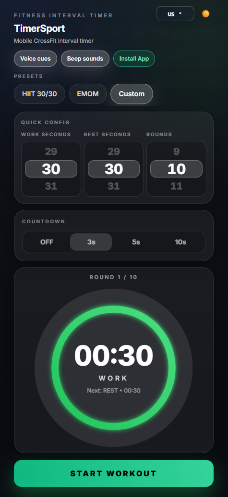

# TimerSport

A fast, mobile-first workout timer for gym and crossfit training. Designed to run as a lightweight web app or Docker container.

[](https://github.com/Maxxiime/TimerSport)


## 📸 Screenshot



> Replace `docs/screenshot.png` with a real screenshot of your TimerSport UI to showcase your setup.

## 🚀 Features

- Mobile-first UI optimized for phone screens
- Gym / Crossfit workout presets
- Countdown voice cues
- Work / Rest interval support
- Progressive timer circle animation
- Voice countdown in multiple languages
- PWA support (installable on phone)
- Lightweight and fast performance
- Docker-ready deployment

## ⚡ Quick Start (Docker Compose)

The fastest way to run TimerSport is with Docker Compose.

### 1️⃣ Clone the repository

```bash
git clone https://github.com/Maxxiime/TimerSport.git
cd TimerSport
```

### 2️⃣ Start the container

```bash
docker compose up -d --build
```

### 3️⃣ Open the app

```text
http://SERVER_IP:4270
```

> For local use: `http://localhost:4270`

## 🔄 Updating the container

```bash
git pull
docker compose up -d --build
```

## 🐳 Manual Docker Build

```bash
docker build -t timersport .
docker run -d -p 4270:80 timersport
```

The app will be available at:

```text
http://localhost:4270
```

## 🔧 Changing the port

Edit `docker-compose.yml` and update the `ports` mapping.

Current mapping:

```yaml
ports:
  - "4270:80"
```

Example using port `5000`:

```yaml
ports:
  - "5000:80"
```

Then redeploy:

```bash
docker compose up -d --build
```

## 📦 Deploy with Portainer

1. Open Portainer.
2. Create a new **Stack**.
3. Use the repository URL: `https://github.com/Maxxiime/TimerSport.git`.
4. Select `docker-compose.yml`.
5. Click **Deploy the stack**.

Portainer will automatically build and run the container.

## 🛑 Stop the container

```bash
docker compose down
```

## 🧹 Clean rebuild

```bash
docker compose down
docker builder prune -f
docker compose up -d --build
```

## 📂 Project structure

```text
src/
public/
Dockerfile
docker-compose.yml
vite.config.js
```

TimerSport is built using:

- React
- Vite
- Tailwind
- Docker
- Nginx

## 🤝 Contributing

Contributions are welcome! Feel free to open an issue for ideas/bugs or submit a pull request with improvements.

## 📜 License

MIT

If you find TimerSport useful, consider contributing to help improve the project.
